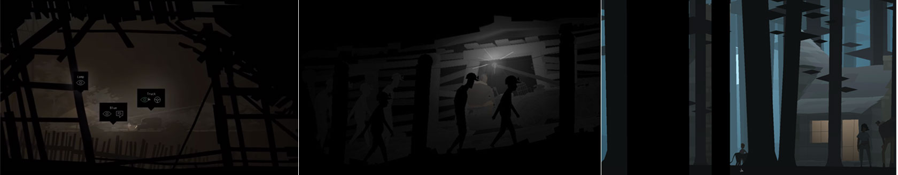

I’m making a tiny visual story focusing on using the camera to tell the story. Among the games I’ve played, KRZ is excellent in using camera. Although it feels more like a stage show using a fixed camera and doing transition by lighting and stage’s transform, the benefit is that its few but notable camera using make it easy to analyze. In this article, I’ll analyze some of my favorite frames.

## Playing as an Audience
*Act I Scene II* begins with a long shot with a surrounded wood fence as foreground. The viewpoint simulates a perceived third person peeping at the protagonists. It indicates that this is a sparsely populated suburb and implies that Conway is a weird outsider, which foreshadows the “haunted” house. Then the player’s first interaction triggers the camera to move forward, transfer the player’s role back to Conway. This setup of starting is used at a lot of scenes in KRZ (e.g., in the museum), it provides more detail of the story’s background, and creates mysteries that interest the player.

In the second half of the mine in *Act I, Scene III*, the game implies the player to turn off the light by a long boring trip and a puzzle solved in *Scene I* which also requires turning off the light. If the player tries to drive in the dark, they’ll see some creepy standing ghosts in the occasional sparks. But the ghosts in the next frames are in the pose of walking. Then you suddenly realize that they are not ghosts but instead the phantoms of the past people. Transferred from horror, the sadness becomes stronger. Here, the narrative is minimalist but precise, because the flash image render these people weak and far away, and the freezing pose renders them heavy and tragic. The design of interaction is also percise because it only happens when the player chooses to walk in the dark and to share the fear with the past people. It’s a great design that makes the feeling really deep.

The picture in the forest of *Act II, Scene VI* is unstable. When Ezra is running, appearing and disappearing between the trees, it seems like he is playing hide and seek with the player. The large trees in the foreground create scene transitions by blocking the sight for a relatively long time. So when Ezra comes out from a tree, it’s already another time & place. This scene’s narrative is similar to the one in the mine, while the player is walking linearly, another story is happening fragmentarily. So the player can experience a long journey in a short time without losing control. 

KRZ frequently let the player change the role they play. Maybe this moment you’re the acting Ezra as a lively kid, the next moment you read his sad past as Shannon; Maybe this moment you’re watching Conway and think he is strange, the next moment you play him. It creates contrast. Memory, history, and sadness are better to be read rather than told by the player because the player needs a chance to be “a good listener”. Because we barely get touched by ourselves, we are touched by the others.

## Inside but Outside
*Act II* begins with a question “Inside or outside?” which is discussed again and again in KRZ. From a game perspective, I think it’s about first-person or non-first-person, avatar or player, player or audience, etc.

When the protagonists enter the bureau’s elevator, the player stops sharing the vision with them but the player’s hearing enters. It keeps the player inside the elevator by the sound and camera’s moving and gives them a preview of the next. This separated feeling also provides a contrast between inside and outside — the cheerful music strengthens the boringness in the office.

In (or outside) the church, characters are located in the right bottom of the picture, leaving the church as the main body. Again, The player’s vision is outside, but their hearing is inside. This contrast depicts the church’s largeness and deserted feeling, and the janitor’s loneliness. But I think this could be stronger if the camera started by a full shot looking at the protagonists, then slowly moving backward to involve the building’s entrance, name and the janitor one by one. This will introduce another contrast between the guest couple and the lonely place.

In *Act II, Scene V*’s museum, the overshoot and the beams in the foreground create a monitor’s viewpoint again, hinting the place is strange and something will happen. It challenged the role of the audiences in the museum as reviewers by letting the player playing as a monitor. Now these audiences become the monitor’s observation objects. The overshoot, glitch text, spotlight and the frame shaped by beams are all for it. But furthermore, in a meta level, the game, its wired dialogues and unusual controlling, is an exhibit to the player. So the player is their exhibit’s exhibit’s exhibit — a loop. It’s another interpretation of “both Inside and outside”. It’s the best part of the game.

The using of the camera in the elevator and the church are borrowed from cinema. But the experience in the museum is unique to games because it separated the player’s control and sense. The player’s foot is on the protagonists but their eyes, mouth, ears are the on the monitors. We are still playing the characters, but without scripted dialogues of them. We imagine the dialogues by the monitors talking. So the game shapes the story by both the designer and the player. It’s inspiring.

## The Eyes of Kids
Ezra’s debut is simple but within one glance we already know he is the kid from Wes Anderson’s films — this kid, although tiny, is supported by a higher platform, an upward shot, a mysterious black silhouette, a symmetrical frame, and the thunderstorm. At first, we may think it’s comical, but step by step the game will show us this young man’s inner strength.

In the next scene, the game doesn’t hurriedly tell Ezra’s story. Instead, it asks the player to read those adults’ stories as Ezra. Children are the best observers because their eyes are pure and they are outside of the adults’ world. When the player is asked to play as a kid, they are implied not to fall into the adults’ helplessness but try to jump out of it, or maybe think in another way. Lately in the game, the player will play as Ezra to solve such problems many times. I think Ezra is the most important member in the team. As an adult, it’s grateful to have a chance to look back to myself as a kid.

## The Wrong feedbacks.
When a game gives the player a wrong feedback, I say it’s a communication moment. The game or the developer is trying to tell the player something by breaking their flow. KRZ uses it many times. But I think the first time they use it is improper.

When Conway comes to Weaver’s house for the first time, there’s an interesting camera movement. After the player clicks “look“ at the TV, the camera moves forward as if Conway is looking toward the TV, but then the camera ignores the TV and looks into the background. It’s a wrong feedback and the game then explains as Conway’s distraction. Lately, the player will be surprised because it’s a foreshadowing for the discovering of the Route 0. But it’s an abrupt foreshadowing because it’s unpredictable to the player. I think it’ll be better if the TV can stop at the edge of the screen,  and let the player to decide whether to be distracted or not. I believe playing tricks on players is not bad especially when you award them with surprise, humor or emotion, but I think giving them some hints ahead will be better. So I’d like to move such trick to the later scenes where Conway’s broken leg and his past can explain more.

## The Staring
In the first shot of Act IV, the strong light creates a feeling of being stared, though Shannon is just looking at the sea. If my feeling is right, this is the first eye contract between character and the player. I think the game is trying to say “Hey, long time no see.” considering it takes 2 years waiting for this act.

The last shot is a top-down view. Characters are facing the truck’s front light. I don’t understand this composition because it builds an opposition between the characters and the truck, but the real problem is the high spiral staircase, not the truck. I wish the people can stand back to the truck and look up to the camera which is also the direction of the stair. It’ll build an opposition between the characters and the stair. I actually want to create an eye contact for a second time and let this act end in staring. Like it’s saying “Hey wake up, it’s time to say goodbye.”