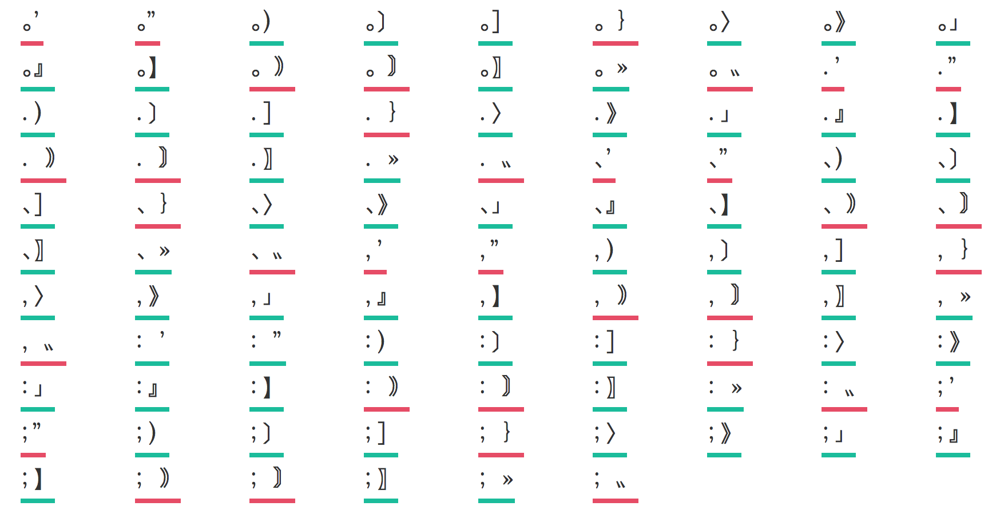

Mojikumi (标点挤压) 是一个利用 Kerning 实现汉字标点挤压的实验项目。目的是在 Web 浏览器中实现标点挤压。目前部分实现了汉字的标点挤压。

[Github](https://github.com/houkanshan/mojikumi)
[Test](https://houkanshan.github.com/mojikumi)

1. 浏览器不会尝试向 CSS 定义的 web font 中查找并使用 Bitmap 字体 (Tested on Chrome & Firefox, Windows)。
2. CSS 的 `@font-face` 中，`src` 属性没有加 `local('xx')` 值的，会覆盖掉本地的字体，即：即使本地有同名的字体，也不会使用。
3. Kerning 与 Ligature 均能实现标点挤压，不同的是，Kerning 只能改变位置，而 Ligature 能改变字形， Ligature 对多字符的情况需要枚举配对，而 Kerning 不需要。
4. Chrome & Safari 中，如果相邻字符各自被标签包裹（``）则会破坏字体的 Kerning 行为，Firefox 不会。（Web 阅读器中通常会对字符用标签包裹，以便进行功能增强和排版优化[如 Google Play Books, 豆瓣阅读, 多看阅读]）
5. FontForge 生成的 SVG Font，在 Firefox, Chrome, Safari 上测试均无法使用（浏览器会请求字体文件，但不能正常使用）。
6. 西文的 brackets 通常不会在 cap height 上垂直居中，而会偏下，是因为小写西文字符的重心偏下。而中文的 brackets 则需要相对于 “cap height” 垂直居中还略偏上。
7. 在测试程序里，由于 Chrome 部分字符对 Kerning 后会在包裹文字的元素内的尾部留下多余的空隙，这个不会对后面的文字的文字造成影响，但会影响 JS 获取到的元素宽度，造成测试结果不准。
8. 其实标点挤压规则虽然有 8 条；但在具体实现中会简单许多，即：当全宽的标点成对时，挤压 1/2 em 的空格即可（即 2 em -> 1.5 em），但这不意味着用代码来处理会简单多少，因为还需要处理换行的情况。
9. 由于 [JIS X 4051](http://www.w3.org/TR/jlreq/#positioning_of_consecutive_opening_brackets_closing_brackets_comma_full_stops_and_middle_dots) 中只描述了直排中的标点挤压规则，而对 “!?;:” 这几个标点在横排时所处的位置或方向与直排不同的情况，没找到较权威的描述，自己修改了这部分的规则，即按照汉语语义：将 “!?;:” 这几个标点与 commas / full stop 作同样的处理。
10. Web Font 的 src 中所有的属性都会被异步处理，无论是 `local()` 或是 `data-URIs`，不会阻塞后续 CSS 或 JS。这也意味着在必要的地方必须检测 Web Font 的 loaded 。

## 不完善的地方：

1. 由于汉字和西文的 quotes 使用的是相同的字符， 为了优先保证英文的显示正常，quotes 的宽度均为 1/2 em，故对类似`。”`的情况无法用 Kerning 在 right quote 后加上 1/2 em 的空格。但用 Ligature 能实现。
2. em dash 的处理上，用 Kerning 的方式处理会导致宽度不够，如果用 Ligature 来做，也会更好；对单独出现的 em dash，可直接显示为西文字体的 em dash，较粗且不会占据整个字宽；对连续的 em dash，可显示为汉字字体的破折号，较细且仅 2em 宽度的两边有空隙。
3. 标点风格可能与其他字符不搭配。以及缺少不同 Style 的标点字体。

----

其实都不是很懂，如果有人看到，请指责咯