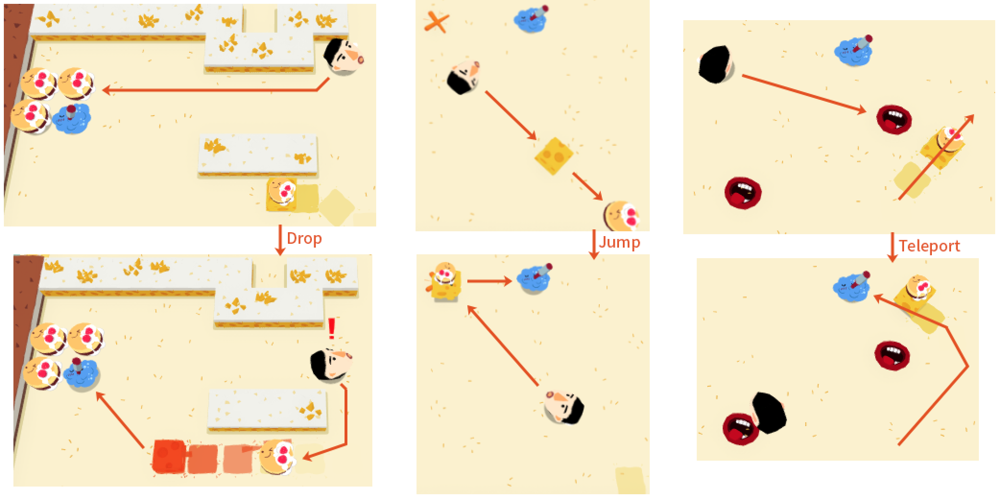

## Summary

Stop Eating is an action puzzle game inspired by *Invisible, Inc.* and its designer’s [GDC talk](https://www.youtube.com/watch?v=-8ZkIKPIDdY). In the game, the player controls a character to solve the puzzles by manipulating the strong but stupid enemies in real-time.

The game has 5 parts and 43 levels. Each level feels like the unequipped character is exposed in a stealth game. The enemies are chasing and can kill the character by touching. The player has to use the environment and limited items to create opportunities to KO the enemies. But the cost of creating opportunities is that the enemies will become stronger. So the player has to make a trade-off between them.

There’re 6 objects in the game: cake, beer, beer cake, cake generator, teleport and jumping mark.

## Design
Although the narrative layer (theme, visual, audio, text) took around half of the development time, as an indie game, the design of its narrative elements can be recognized clearly. So I will focus on the design of its system here.

### Designing Around Opportunities

For me, the most interesting part of *Invisible, Inc.* is the gameplay of creating opportunity by distracting the enemy. So I designed the game around opportunities.

For me, opportunity in a game is the possibility of moving from danger to safety. The value of designing opportunity is: **1)** Opportunity appears only in the right game state (time, space, player actions), it connects all the resources in the game. **2)** Opportunity can’t be got by grinding. **3)** Opportunities are unstable. They disappear when time or space changes. The player should catch them and protect them.

To make the opportunity unstable, I decided to make the game real-time and free movement which also provide execution and time pressure. But then it comes the conflict between execution and puzzle solving. One provides uncertainty while the other requires estimates. Being a tactical game and puzzle game lover, I tried to lower the requirement on execution and focus on tactical and puzzle, and simplify the system so the player can make decisions easier. 

I started with designing level with handmade puzzles, and I found it works well, so I didn’t introduce randomness in the game.

Since opportunity is about danger and safety, I should first design the danger in the game.

### Designing Danger

The danger comes from the enemies quantity, attack, defense and moving. Shooting weapon is too powerful; Also dodging the bullet needs execution. Random moving makes it hard to use strategy. So I decide the enemy will be faster than the character, and its movement is predictable.

The character will only have 1 heart, so players don’t need to manage the health resource. It also makes each level fail faster, so the players can see their fault clearly. For symmetry, each enemy also only has 1 heart, but as a trade-off, they can clone themselves. I think it’s more interesting to have 2 one-heart enemies than 1 two-heart enemy.

### From Danger to Safety

Players’ abilities can be speeding up themselves, slowing down the enemies, and KO the enemies. But these abilities are always the right choices and using them is boring. So the game needs some dramatic events which come from the approaching danger and the resolving of it. It means that the game should enter a state where almost all the choices are wrong, except for some hidden but right choices. These choices are hidden because in most cases they’re unavailable or not the right choices.

I think the hidden choices usually come from **1)** deus ex machina (from randomness or story); **2)** unrecognized combo (from analysis); **3)** indirect attack (enemies’ mistake, making traps, sacrificing, or creating combo). Since randomness, high-skill execution and complicate tactic are excluded in my game, the hidden choices can be distracting enemies, making traps like teleport, pushing, and confusing.

### Verbs

So I made some basic verbs to support these mistakes:

- The character will speed up once she drops anything. Because dropping always means losing – a negative effect.
- Collect a beer and a cake will mix them and produce a beer cake.
- Dropping a beer cake can attract and KO an enemy.
- Drop a cake. Its positive effect is attracting enemies from far, which can be used to distract. The negative effects: 1) Losing a material of beer cake. 2)  An enemy can separate into 2 fresh enemies after eating 2 cake.
- Drop a beer. Its positive effect is slowing down the enemy when touched. It’s symmetric with cake’s effect – it affects the enemies near the character. The negative effect is slighter than dropping a cake because it can be picked up again, although it’s not easy while being chased. 

These verbs are not enough for distracting since the player’s speed is slower than enemies’. So the enemies should be more stupid in moving: they only target the nearest cake in the straight-line distance. So walls do not only create obstacles but also traps.

The speed-up ability encourage the player to drop items while slowing down the enemies gives the player a chance to make a plan. I found that the enemies’ speed can be just a little bit faster than the player’s because it created a lot “so close” moments.

I still need a way to distract the enemies away from the player. Like dropping a cake remotely, but not that easy. So I added a cake generator which periodically produces new cakes. It’s an item that can distract the enemies in the future, so the player can let the enemies chase them and waits for the new cake. It also provides cakes for the player. However, if the player doesn’t collect the generated cakes in time, they will be eaten by the enemies and increase the enemies' quantity.

Teleport is an overused mechanic in other games. Usually, players can use it as a shortcut, but it’s more interesting to use it on enemies – a chased player can just wait for the enemies behind a teleport and watch them being teleported away. If the 2 teleports are close, the player can even trap an enemy into an infinite loop between these 2 teleports. I kept teleport because it can make full use of the enemy’s stupidity.

Jumping mark is another ability to help the character with moving. The character can jump onto the jumping mark at anywhere in the level. They can use it to get rid of the enemy or attract them or as a shortcut. It’s different from teleport because: 1) The player has to make one more decision – where to jump?  2) It’s a one-way trip.

To make the enemies attack their friends, I need a new object to change the enemies’ state. So it can be combined with another verb – pushing. Like butter? Once an enemy touches it, he will slip forward until hits a wall, a cake or the character. Meanwhile, he will become delicious because he’s covered with butter. So the other enemies will chase and eat him. Butter will remove 1 enemy, but it won’t work on the last enemy. It can push an enemy away as well as towards the character. I didn’t implement it for simplifying the system. But I regretted later because it’s really lovely when the enemies crowd together for a “delicious” guy.

## Mistakes & Problems

A stupid mistake I made again after my last game is that all the levels are of the same size.  Theoretically, the map size should only depend on the puzzle; thus every puzzle has its own map size. Using the same map size only benefits the development of level editor and camera. I’m just too lazy.

The biggest problem is the pace of the levels. I used 12 out of 43 levels to introduce the 4 basic objects. It’s too long. I designed these levels to make sure the player masters the execution of basic verbs, because only after they know the result of a good execution can they use it to estimate the solution to a puzzle.

But I didn’t realize that the puzzle solving skills and execution skills should be improved together through the whole game. Also, I think the execution is harder to improve than puzzle solving because players' execution fails easily by mistake. And the player bores quickly when they are retrying for mistakes. So maybe I should feed them something new while training, like new puzzles or new objects. But if I allow players to solve a puzzle with bad execution, that means they can ignore the puzzle and solve it with good execution, then the puzzle solving skill is not trained. Or I can slow down the game at the beginning, but it makes each level longer.

So basically, my game has a time pressure – the enemy is chasing the character. But time pressure is conflicted with the good puzzle. I should focus on the valuable problems.

I think problems like this CAN’T be completely avoided by just designing and analyzing. The real problem is lacking playtest. Although I knew the importance of playtest, the idea “playtest is not development” was push me away from it. Another reason is that as an indie game developer living in China, it’s hard to find someone to test my cheap, small, harsh, weird, storyless game. 

So I think maybe I can try some game genres that are easier to test. Like mobile games, I can ask my friends to test anywhere. Like procedural generation, a tester won’t be bored by the same level all the time. Like local multiplayer games, where I become the “procedural” generated part, also it is more social.

### Problems of Theme

I’d like to talk about the theme here because I think the current theme is a mistake. 

Firstly, I won’t use the theme of zombies or monsters because it’s boring. “Kill all the cockroaches” is my first thought because one way of killing them is to feed them with poisoned food, which just matches the gameplay. But it’s disgusting, and I failed drawing the cockroach funny. So I turned to the current theme. 

The idea of foods vs. human is just like plants vs. zombies. The player controls a weak character to fight against strong enemies. It also has a feeling of anti-human-centered opinion. But it's hard to render the enemies as the whole human instead of just a certain part of us. As a result, it seems more like the game is telling people don’t eat too much for their health, which is a controversial opinion because “[Health at Every Size (HAES)](https://en.wikipedia.org/wiki/Health_at_Every_Size)”. The game’s weird and funny style makes it even more disrespectful. The reason for making this mistake is that I thought system design is the most important thing, so I spent little time on the theme.

To me, making games is a way to express myself. My games are part of me. They will express my opinion, attitude, temperament, and taste. I should be more serious about their theme. This game makes me feel like a reckless young man (maybe it’s true). I should give a response to it in my next game.
